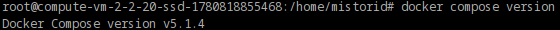
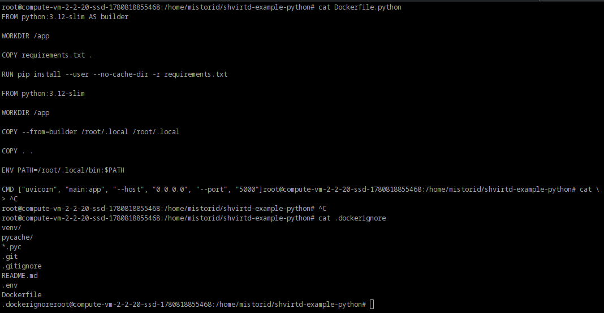
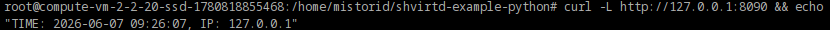
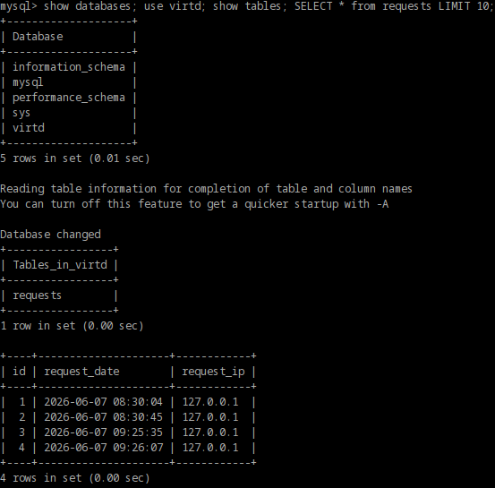
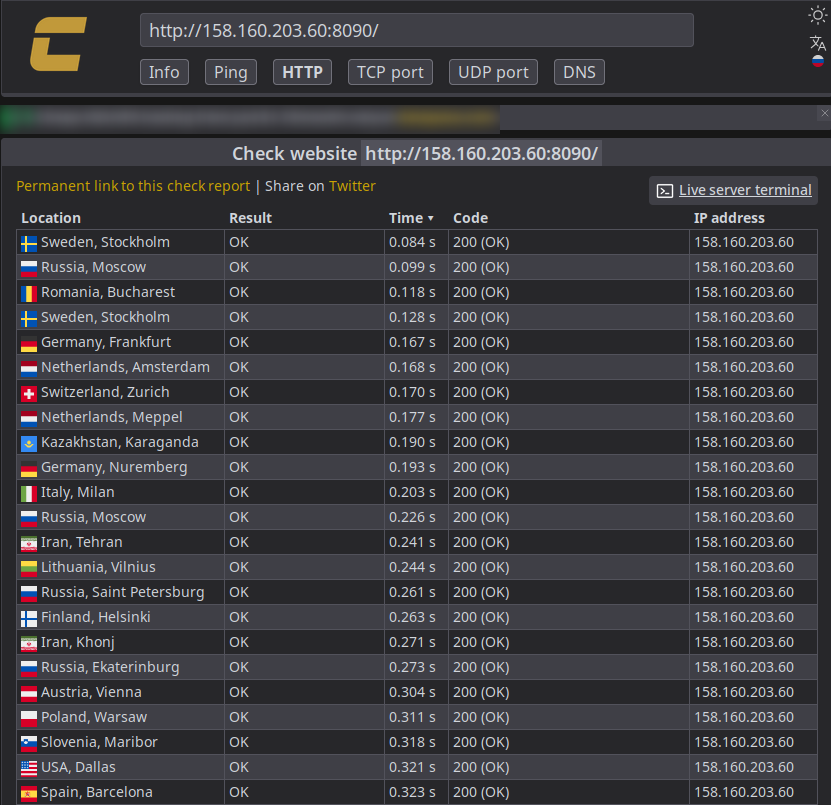
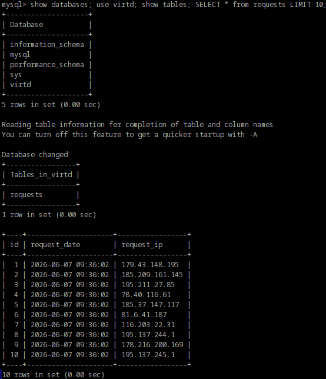
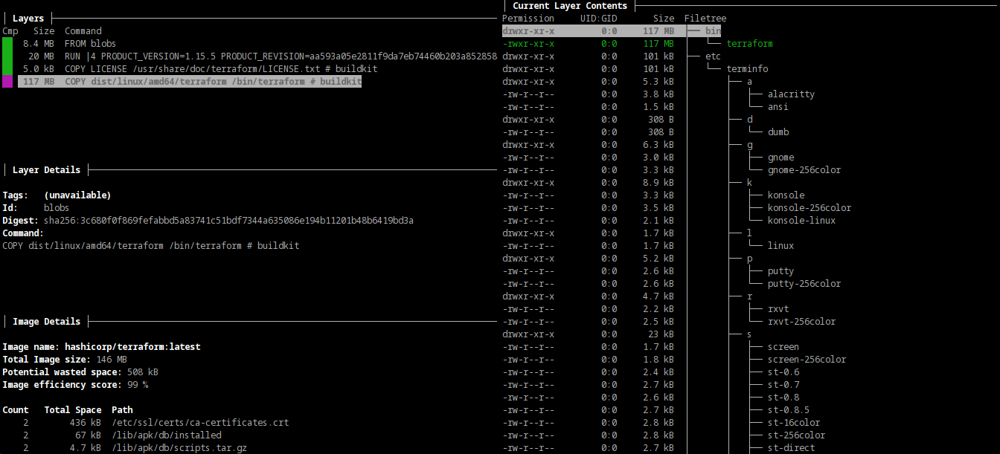
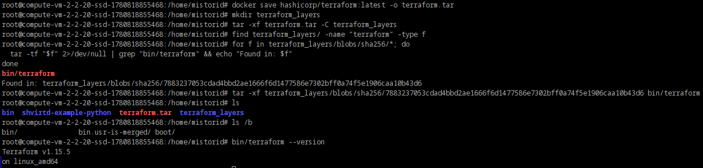
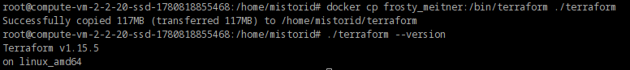

# Домашнее задание к занятию "`Практическое применение Docker`" - `Шмагин Максим`

### Задание 0.

### Задание 1.

https://github.com/MistoriD/shvirtd-example-python.git

### Задание 3.

https://github.com/MistoriD/shvirtd-example-python/blob/main/compose.yaml - compose.yml

### Задание 4.

### Задание 6.

### Задание 6.1.

